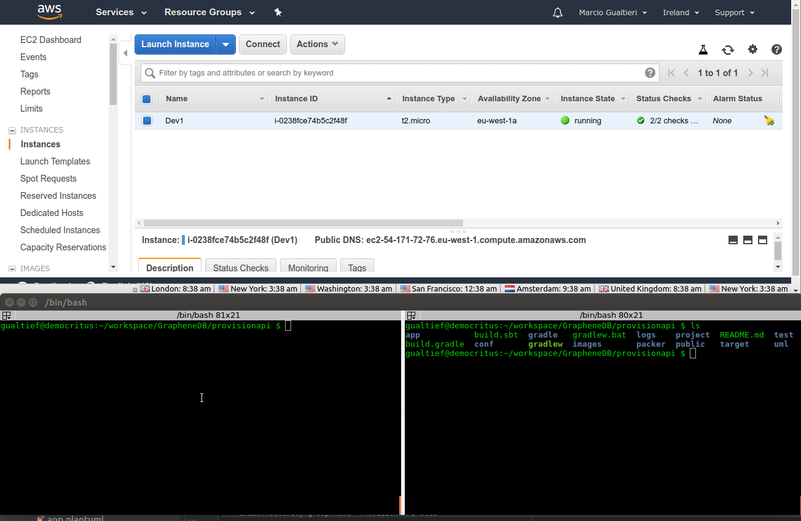
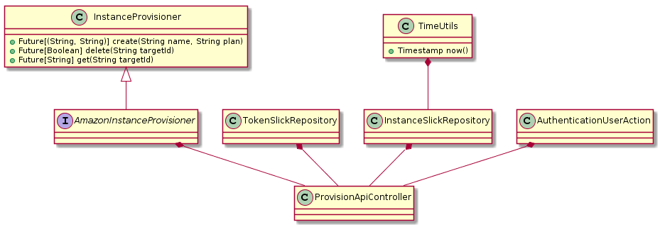
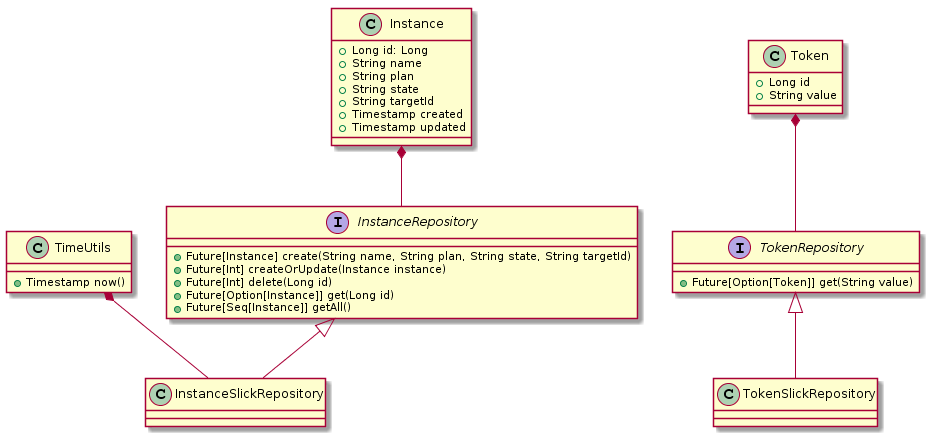
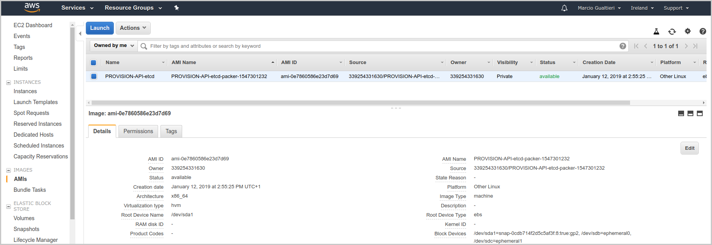
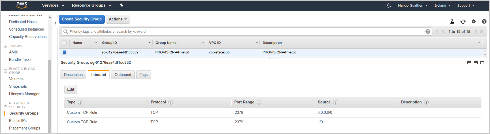

<!-- START doctoc generated TOC please keep comment here to allow auto update -->
<!-- DON'T EDIT THIS SECTION, INSTEAD RE-RUN doctoc TO UPDATE -->
**Table of Contents**

- [Provision API](#provision-api)
  - [Overview](#overview)
  - [Design](#design)
    - [Storing State and Tokens](#storing-state-and-tokens)
    - [Authentication](#authentication)
  - [Running Tests](#running-tests)
  - [Deployment Guide](#deployment-guide)
    - [Configuration](#configuration)
    - [etcd](#etcd)
      - [Installing](#installing)
      - [Running](#running)
      - [Testing](#testing)
      - [Creating a Service (single-node)](#creating-a-service-single-node)
    - [Packer](#packer)
      - [Installing](#installing-1)
      - [Building a Template](#building-a-template)
      - [Testing](#testing-1)
  - [Running the App](#running-the-app)

<!-- END doctoc generated TOC please keep comment here to allow auto update -->

# Provision API

<kbd></kbd>

## Overview

The purpose of this project is to showcase my back-end development skills in Scala, particularly with the [Play Framework](https://www.playframework.com/).

In short, the project consists of a REST-API capable of provisioning (running), de-provisioning (terminating) EC2 instances on Amazon Web Services.

The API also allows listing all available instances, as well as, instances individual detailed info.

The instances are created from an AMI template, which needs to be deployed previously to deploying and running the app (refer to the `Deployment Guide > Packer` section).

For more detailed information on the requirements, refer to [this document](https://gist.github.com/juanjoandres/96fffc4ae20af9fe0884cca0d24e6d2a).

## Design

<!---
Plant UML Diagrams only work if the repository is public
-->

<!---
[comment]: <> ()
-->

The Play Framework follows a MVC pattern, but given that we are only implementing the back-end, there's no view, only a model and a controller.

The model is represented by the repository classes in the diagram.

Note also the provisioning class `AmazonInstanceProvisioner`, which encapsulates the functionality required to interact with Amazon Web Services.

This class implements the interface `InstanceProvisioner` and uses the [Java AWS SDK](https://aws.amazon.com/sdk-for-java/), specifically the EC2 client.

### Storing State and Tokens

The requirements document suggests that the storage of the state of provisioned instances and authentication tokens could be kept in memory.

Given that the Play Framework can be easily configured to use a [H2 in-memory database](http://www.h2database.com/html/main.html), I have opted for this solution.

This makes easier to migrate to a real database, which at the end of the day, is the kind of storage that would be required in production.

Here's a class diagram detailing the implementation of the model (repository classes):

<!---
Plant UML Diagrams only work if the repository is public
-->

<!---
[comment]: <> (()
-->

Note `TimeUtils`, which is required to make `InstanceSlickRepository` testable. Decoupling time keeping functionality makes possible to mock timestamps in the unit tests.

### Authentication

Authentication has been implemented using [Play Framework's Actions](https://www.playframework.com/documentation/2.6.x/ScalaActions). At the moment, authentication consists of a simple action that simples verifies the presence of a valid token in the header (field `X-AUTH`).

Authentication tokens, as mentioned in the previous section, are stored in the database (`TokenSlickRepository`). I'm using [evolution scripts](evolutions/default) to initialize the database with a single valid token, which is also used in the unit tests.

## Running Tests

To run tests, execute the following command-line in a terminal:

    $ sbt clean test

You should get an output similar to the following:

    [info] ProvisionApiControllerSpec:
    [info] ProvisionApiController GET
    [info] - should render the index page
    [info] - should render an instance
    [info] - should respond with <not found> when instance does not exist
    [info] - should deny access to render an instance without an authentication token
    [info] - should deny access to render instance with an invalid authentication token
    [info] - should render all instances
    [info] - should deny access to render all instances without an authentication token
    [info] - should deny access to render all instances with an invalid authentication token
    [info] ProvisionApiController POST
    [info] - should provision a new instance
    [info] - should deny access to provisioning an instance without authentication token
    [info] - should deny access to provisioning an instance with an invalid authentication token
    [info] ProvisionApiController DELETE
    [info] - should de-provision an instance
    [info] - should respond with <not found> when an instance does not exist
    [info] - should deny access to de-provisioning an instance without authentication token
    [info] - should deny access to de-provisioning an instance with an invalid authentication token
    [info] ScalaTest
    [info] Run completed in 17 seconds, 512 milliseconds.
    [info] Total number of tests run: 15
    [info] Suites: completed 1, aborted 0
    [info] Tests: succeeded 15, failed 0, canceled 0, ignored 0, pending 0
    [info] All tests passed.
    [info] Passed: Total 15, Failed 0, Errors 0, Passed 15
    [success] Total time: 67 s, completed 17-Jan-2019 08:03:47

## Deployment Guide

### Configuration

You will need a valid Amazon Web Services account and the following environment variables need to be set in your O.S.:

- `AWS_ACCESS_KEY_ID`

- `AWS_SECRET_ACCESS_KEY`

You will also need a key-pair and security group specifically for the application:

    amazon.key.pair.name="Dev"
    amazon.security.group.name="PROVISION-API-etcd"

Additionally, you need an image for the database being provisioned (refer to `Deployment Guide > Packer` section).

Under the folder `packer` there are all configuration needed to create the image, which needs to be added to the configuration as follows:

    amazon.image.id="ami-0e7860586e23d7d69"

### etcd

#### Installing

To install etcd in your local machine, download the proper `*.zip` file for your O.S. from [here](https://github.com/etcd-io/etcd/releases).

This `*.zip` contains a folder with all executables and documentation, which should be unzipped and added to your `$PATH` variable.

Another option (recommended) is to copy the etcd's binaries to `/usr/bin/`:

    $ sudo cp /path/to/install/files/etcd* /usr/bin/

#### Running

To start the service, execute the following command:

    $ etcd

#### Testing

To sanity check your installation, execute the following command:

    $ curl -L http://localhost:2379/version

You should get an output similar to the following:

    {"etcdserver":"3.3.10","etcdcluster":"3.3.0"}

To create a key, execute the following command:

    $ curl http://localhost:2379/v2/keys/MyKey -XPUT \
    -d value="MyValueForMyKey"

You should get an output similar to the following:

    {"action":"set","node":{"key":"/MyKey","value":"MyValueForMyKey",
    "modifiedIndex":4,"createdIndex":4}}

To retrieve the key you've just created, execute the following command:

    $ curl http://localhost:2379/v2/keys/MyKey

You should get an output similar to the following:

    {"action":"get","node":{"key":"/MyKey","value":"MyValueForMyKey",
    "modifiedIndex":4,"createdIndex":4}}

To change the key's value, execute the following command:

    $ curl http://localhost:2379/v2/keys/msg -XPUT \
    -d value="MyNewValueForMyKey”

You should get an output similar to the following:

    {"action":"set","node":{"key":"/MyKey","value":"MyNewValueForMyKey",
    "modifiedIndex":5,"createdIndex":5},
    "prevNode":{"key":"/MyKey","value":"MyValueForMyKey",
    "modifiedIndex":4,"createdIndex":4}}

To delete the key, execute the following command:

    $ curl http://localhost:2379/v2/keys/MyKey -XDELETE

You should get an output similar to the following:

    {"action":"delete","node":{"key":"/MyKey","modifiedIndex":6,
    "createdIndex":5},"prevNode":{"key":"/MyKey",
    "value":"MyNewValueForMyKey","modifiedIndex":5,"createdIndex":5}}

#### Creating a Service (single-node)

Create an UNIX user for the service:

    $ sudo adduser etcd

Create a folder for the data store:

    $ sudo mkdir /var/lib/etcd

Make the user own the data store folder:

    $ sudo chown etcd /var/lib/etcd

Create a system service configuration file (you may use this [template](packer/etcd.service)) and copy it to the services folder:

    $ sudo cp etcd.service  /etc/systemd/system

For my own reference, you may find more information about configuration parameters for etcd [here](https://coreos.com/etcd/docs/latest/v2/configuration.html).

Start the service:

    $ sudo systemctl start etcd

To stop the service, execute the following command:

    $ sudo systemctl stop etcd

Enable service startup on boot:

    $ sudo systemctl enable etcd.service

### Packer

#### Installing

To install packer in your local machine, download the proper `*.zip` file for your O.S. from [here](https://www.packer.io/downloads.html).

This `*.zip` contains a single executable file, which should be unzipped and added to your `$PATH` variable.

#### Building a Template

If any changes were made in the template:

    $ packer validate etcd.json
    $ packer inspect etcd.json

Finally, to build the template and provision the AMI to AWS:

    $ packer build etcd.json

You should get an output similar to the following:

    amazon-ebs output will be in this color.

    ==> amazon-ebs: Prevalidating AMI Name: PROVISION-API-etcd-packer-1547301232
        amazon-ebs: Found Image ID: ami-0233bae36f499afe8
    ==> amazon-ebs: Creating temporary keypair: packer_5c39f170-ee5c-40fa-960a-8af0a7f26089
    ==> amazon-ebs: Creating temporary security group for this instance: packer_5c39f172-618a-fc8d-cb06-ef9cfdbcef97
    ==> amazon-ebs: Authorizing access to port 22 from 0.0.0.0/0 in the temporary security group...
    ==> amazon-ebs: Launching a source AWS instance...
    ==> amazon-ebs: Adding tags to source instance
        amazon-ebs: Adding tag: "Name": "Packer Builder"
        amazon-ebs: Instance ID: i-051d3726725a9bf54
    ==> amazon-ebs: Waiting for instance (i-051d3726725a9bf54) to become ready...
    ==> amazon-ebs: Using ssh communicator to connect: 34.241.12.9
    ==> amazon-ebs: Waiting for SSH to become available...
    ==> amazon-ebs: Connected to SSH!
    ==> amazon-ebs: Uploading ./etcd.service => /home/ubuntu/
    1 items:  431 B / 431 B [==============================================================================================] 0s
    ==> amazon-ebs: Provisioning with shell script: etcd-install.sh
        amazon-ebs: Adding user `etcd' ...
        amazon-ebs: Adding new group `etcd' (1001) ...
        amazon-ebs: Adding new user `etcd' (1001) with group `etcd' ...
        amazon-ebs: Creating home directory `/home/etcd' ...
        amazon-ebs: Copying files from `/etc/skel' ...
        amazon-ebs: Created symlink from /etc/systemd/system/multi-user.target.wants/etcd.service to /etc/systemd/system/etcd.service.
    ==> amazon-ebs: Stopping the source instance...
        amazon-ebs: Stopping instance, attempt 1
    ==> amazon-ebs: Waiting for the instance to stop...
    ==> amazon-ebs: Creating unencrypted AMI PROVISION-API-etcd-packer-1547301232 from instance i-051d3726725a9bf54
        amazon-ebs: AMI: ami-0e7860586e23d7d69
    ==> amazon-ebs: Waiting for AMI to become ready...
    ==> amazon-ebs: Adding tags to AMI (ami-0e7860586e23d7d69)...
    ==> amazon-ebs: Tagging snapshot: snap-0cdb714f2d5c5af3f
    ==> amazon-ebs: Creating AMI tags
        amazon-ebs: Adding tag: "Name": "PROVISION-API-etcd"
        amazon-ebs: Adding tag: "Env": "PROVISION-API"
    ==> amazon-ebs: Creating snapshot tags
    ==> amazon-ebs: Terminating the source AWS instance...
    ==> amazon-ebs: Cleaning up any extra volumes...
    ==> amazon-ebs: No volumes to clean up, skipping
    ==> amazon-ebs: Deleting temporary security group...
    ==> amazon-ebs: Deleting temporary keypair...
    Build 'amazon-ebs' finished.

    ==> Builds finished. The artifacts of successful builds are:
    --> amazon-ebs: AMIs were created:
    eu-west-1: ami-0e7860586e23d7d69

Your new AMI (`ami-0e7860586e23d7d69` in this example) should be visible in the AWS console under `IMAGES > AMIs`:

#### Testing

You may test your AMI by launching an EC2 instance from it and [connecting to it](https://docs.aws.amazon.com/quickstarts/latest/vmlaunch/step-2-connect-to-instance.html).

You will need a key pair (under `NETWORK & SECURITY > Key Pairs` on the console to SSH connect to it) and a security group (under `NETWORK & SECURITY > Security Groups` on the console to allow the required ports) for this purpose.

## Running the App

To start the app, execute the following command-line on a terminal:

    $ sbt run

Follow next some http calls that may be used to test the app.

To provision an instance:

    curl -XPOST -H "Content-Type: application/json" \
    -H "X-AUTH: bWFyY2lvZ3VhbHRpZXJpOmRkamtsbXJydmN2Y3VpbzQzNA==" \
    -d "{\"name\":\"Test Instance\",\"plan\":\"T2Micro\"}"  \
    http://localhost:9000/databases

You should get an output similar to the following:

    {"id":1,"name":"Test Instance","plan":"T2Micro","state":"pending",
    "targetId":"i-05604590c6c789a5f",
    "created":"2019-01-17T10:19:41.156Z","updated":"2019-01-17T10:19:41.156Z"}

To list all available instances:

    curl -s -H "X-AUTH: bWFyY2lvZ3VhbHRpZXJpOmRkamtsbXJydmN2Y3VpbzQzNA==" \
    -XGET http://localhost:9000/databases

You should get an output similar to the following:

    [{"id":1,"name":"Test Instance","plan":"T2Micro"},
    {"id":2,"name":"Another Test Instance","plan":"T2Micro"}]

To list a particular instance:

    curl -s -H "X-AUTH: bWFyY2lvZ3VhbHRpZXJpOmRkamtsbXJydmN2Y3VpbzQzNA==" \
    -XGET http://localhost:9000/databases/1

You should get an output similar to the following:

    {"id":1,"name":"Test Instance","plan":"T2Micro","state":"running",
    "targetId":"i-05604590c6c789a5f",
    "created":"2019-01-17T10:19:41.156Z",
    "updated":"2019-01-17T10:19:41.156Z"}

To de-provision an instance:

    curl -XDELETE -H "Content-Type: application/json" \
    -H "X-AUTH: bWFyY2lvZ3VhbHRpZXJpOmRkamtsbXJydmN2Y3VpbzQzNA==" \
    http://localhost:9000/databases/1

You should get an output similar to the following:

    ID=[1] DELETED.
